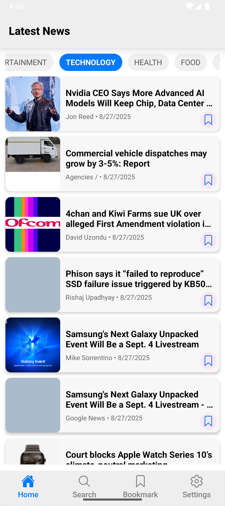
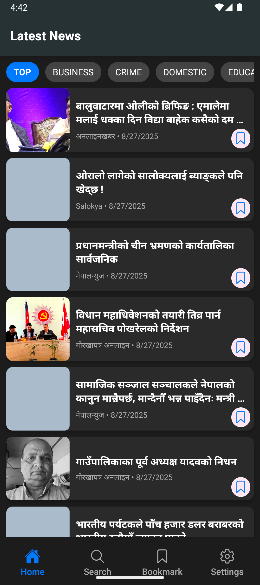
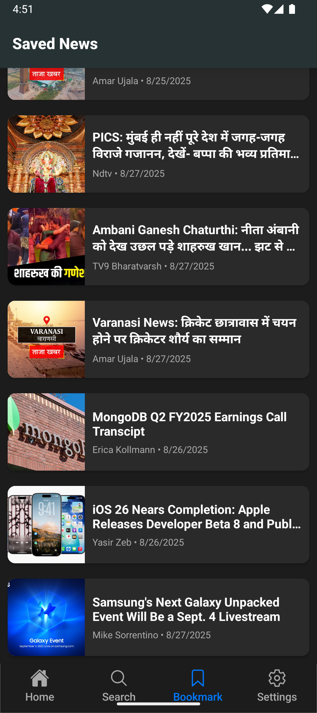
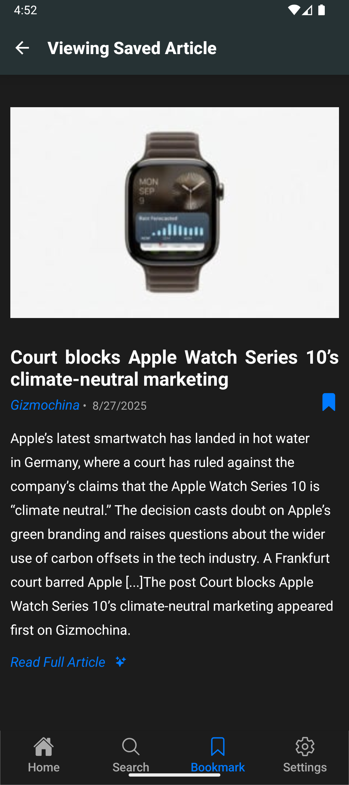
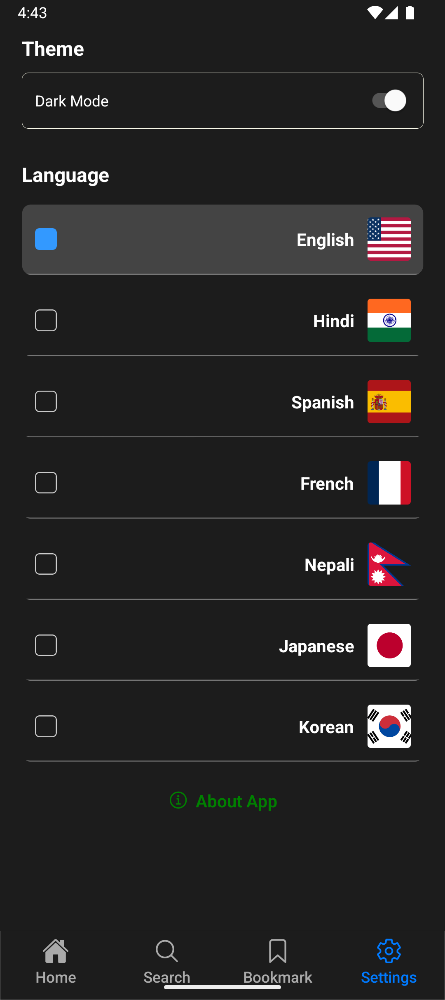
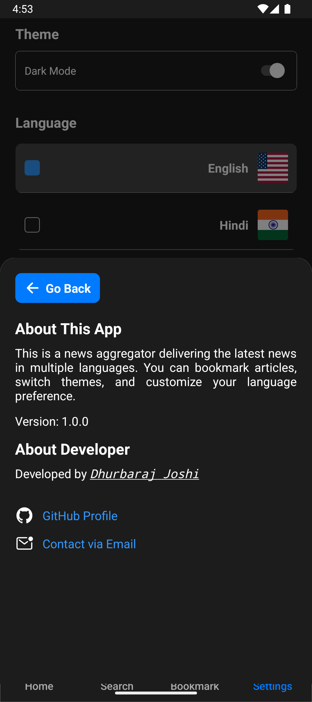

# 📰 News App

A modern **React Native News App** built with **Bare React Native CLI**.
Supports **Dark/Light themes**, **multi-language support**, **search with highlights**, and the ability to **save articles** for later reading.

---

## ✨ Features

* 🌗 **Dark/Light Mode** – Seamless theme switching
* 🌍 **Multi-language Support** – English, Hindi, Spanish, French, Nepali, Japanese, Korean
* 🔎 **Search News** – Real-time search with **highlighted keywords**
* 💾 **Saved News** – Bookmark & manage saved articles
* ℹ️ **About App & Developer** – Modal with developer details
* 🚀 **Optimized API calls** – Prevents multiple clicks on search & caches data
* 📱 **Ready for Play Store** (AAB & APK build support)

---

## 🖼️ Screenshots

### 🔥 Home Screen (News Feed)

| Light Mode                             | Dark Mode                             |
| -------------------------------------- | ------------------------------------- |
|  |  |

---

### 🔍 Search News

| Search Input                             | Search Results with Highlight              |
| ---------------------------------------- | ------------------------------------------ |
|  |  |

---

### 💾 Saved News

| Saved Articles                         | Saved Details                             |
| -------------------------------------- | ----------------------------------------- |
|  |  |

---

### ⚙️ Settings / About App

| Settings                             | About Developer                   |
| ------------------------------------ | --------------------------------- |
|  |  |

---

## 🛠️ Tech Stack

* **React Native CLI (Bare Project)**
* **React Navigation (Stack + BottomTab)**
* **Context API** (theme, language, saved news)
* **AsyncStorage** (persisting settings & saved articles)
* **TypeScript (optional if enabled)**

---

## 📦 Installation

```bash
# Clone repo
git clone https://github.com/dee-raj/news.git
cd news

# Install dependencies
npm install
# or
yarn install

# Install pods (iOS only)
cd ios && pod install && cd ..
```

---

## 🚀 Run App

### For Android

```bash
npx react-native run-android
```

### For iOS

```bash
npx react-native run-ios
```

---

## ⚙️ Build (Release)

### Generate APK

```bash
cd android
./gradlew assembleRelease
```

### Generate AAB (Play Store)

```bash
cd android
./gradlew bundleRelease
```

---

## 📂 Project Structure

```
news-app/
│── android/               # Native Android files
│── ios/                   # Native iOS files
│── src/
│   ├── components/        # Reusable UI components
│   ├── context/           # Theme, language & saved state
│   ├── navigation/        # Stack & BottomTab navigation setup
│   ├── screens/           # App screens
│   ├── utils/             # Helper functions & constants
│── App.js / App.tsx       # Entry point
```

---

## 👨‍💻 Developer

**Dhurbaraj Joshi**
📧 [moon.knight73@gmail.com](mailto:moon.knight73@gmail.com) <br/>
🌐 \[Portfolio / Website](https://dhurbaraj-joshi.vercel.app/)

---

## 📜 License

This project is licensed under the **MIT License**.